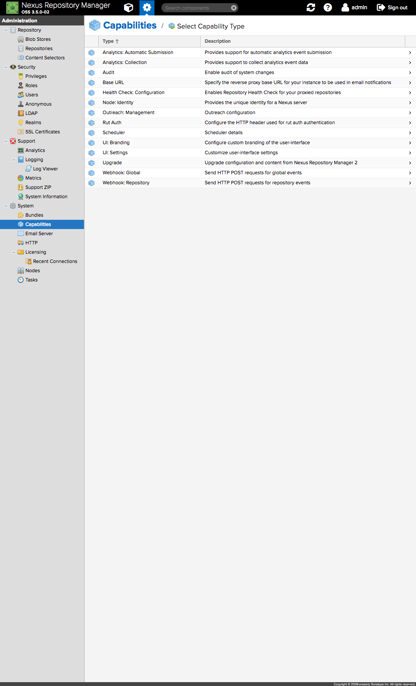
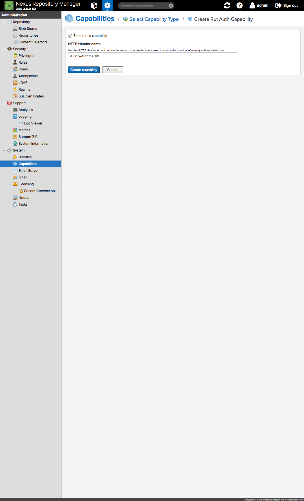

# Configuring `nexus-proxy` GCP IAM Authentication

## Table of Contents

* [Pre-Requisites](#pre-requisites)
* [Enable Cloud Resource Manager API](#enable-crm-api)
* [Configure the OAuth Consent Screen](#configure-consent)
* [Create an OAuth Client ID](#create-oauth-client)
* [Create and distributed the Java Keystore](#java-keystore)
* [Enable GCP IAM authentication in Nexus](#enable-gcp-iam-auth)
* [Deploying](#deploying)
* [Using Nexus with Google Cloud IAM Authentication](#usage)

## Pre-Requisites

Enabling GCP IAM authentication in `nexus-proxy` requires:

* Access to the _Google Cloud Resource Manager API_.
* An OAuth consent screen and client ID to be configured.
* A Java keystore to sign user tokens (JWT) to be created.

This document walks through the setup of each of these requirements in detail.

**ATTENTION**: For users to authenticate, **they must be** part of the GCP
organization and must use their respective email address as the username.
Each user **must also** have "_Organization Viewer_" permissions
[**at organization-level**](https://cloud.google.com/iam/docs/resource-hierarchy-access-control)
(i.e., in the "_IAM & Admin_" section of the organization in the GCP UI),
otherwise they won't be able to authenticate.
For more details, consult the
[proxy requirements](https://github.com/travelaudience/nexus-proxy#before-proceeding).

<a id="enable-crm-api">

## Enable Cloud Resource Manager API

For one to enable the Cloud Resource Manager API, one must:

1. Go to "_Google Cloud Platform_ > _APIs & services_ > _Library_".
1. Search for "_Google Cloud Resource Manager API_" and click the link in the
results box.
1. Click the "_Enable_" button.

<a id="configure-consent">

## Configure the OAuth Consent Screen

For one to configure the OAuth consent screen, one must:

1. Go to "_Google Cloud Platform_ > _APIs & services_ > _Credentials_".
1. Click "_OAuth consent screen_".
1. Fill in the form with appropriate values (e.g.,
_Nexus Repository Manager_ in _Product name shown to users_).
1. Click "_Save_".

<a id="create-oauth-client">

## Create an OAuth Client ID

For one to create an OAuth Client ID, one must:

1. Go to "_Google Cloud Platform_ > _APIs & services_ > _Credentials_".
1. Click "_Create Credentials_ > _OAuth client ID_".
1. Select "_Web application_".
1. Under "_Name_" specify "_nexus-proxy_".
1. Under "_Authorized JavaScript origins_" add all the URLs one may be using to
access Nexus (e.g. both http://nexus.example.com and https://nexus.example.com).
1. <b id="b1"></b>Under "_Authorized redirect URIs_" add the HTTPS variant of
the URL suffixed with `/oauth/callback`
(e.g., https://nexus.example.com/oauth/callback).
1. Take note of the resulting _client ID_ and _client secret_.

<a id="java-keystore">

## Create and distribute the Java Keystore

A Java keystore is needed in order for the proxy to sign user tokens (JWT).
One must create the keystore as follows:

```bash
$ keytool -genkey \
          -keystore keystore.jceks \
          -storetype jceks \
          -keyalg RSA \
          -keysize 2048 \
          -alias RS256 \
          -sigalg SHA256withRSA \
          -dname "CN=,OU=,O=,L=,ST=,C=" \
          -validity 3651
```

When prompted for two passwords, one must make sure the passwords match.
Also, one is free to change the value of the `dname`, `keystore` and `validity`
parameters.
For further details please refer to [travelaudience/nexus-proxy](https://github.com/travelaudience/nexus-proxy#generating-the-keystore).

After creating the keystore, it must be made available to the Kubernetes cluster,
as follows:

1. Run the following command replacing,
   `/path/to/keystore.jceks` and `KEYSTORE_PASSWORD` with the path to the
   keystore file created and the password chosen for the keystore,
   respectively:

    ```bash
    $ cat << EOF > nexus-proxy-ks-secret.yaml
    apiVersion: v1
    kind: Secret
    metadata:
      name: nexus-proxy-ks
    type: Opaque
    data:
      keystore: $(cat /path/to/keystore.jceks | base64)
      password: $(echo -n "KEYSTORE_PASSWORD" | base64)
    EOF
    ```

    This will create a Kubernetes secret containing the keystore file and
    the password, ready to be imported into the cluster and be accessible
    by Nexus.
1. Create the secret, as follows:

   ```bash
   $ kubectl create -f nexus-proxy-ks-secret.yaml
   ```

<a id="enable-gcp-iam-auth">

## Enable GCP IAM authentication in Nexus

In order to enable GCP IAM authentication for Nexus, one must first create the
"_Rut Auth_" capability in the Nexus administration page, as follows:

1. Inside Nexus, go to "_Server Administration and Configuration_ > _System_ >
   _Capabilities_".


1. Click "_Create capability_" and choose "_Rut Auth_" on the list.



1. When asked for "_HTTP Header Name_" enter `X-Forwarded-User`.



1. Click "_Create capability_".

Then, one must edit the
`nexus-iam-statefulset.yaml` descriptor, as follows:

1. Set the value of `CLOUD_IAM_AUTH_ENABLED` to `"true"`.
1. Set the value of `CLIENT_ID` to the value obtained in
the last step of [Create an OAuth Client ID](#create-oauth-client).
1. Set the value of `CLIENT_SECRET` to the value obtained
in the last step of [Create an OAuth Client ID](#create-oauth-client).
1. Set the value of `ORGANIZATION_ID` according to the desired authentication
organization.
   * One can find this value by running `gcloud organizations list`.
1. Set the value of `REDIRECT_URL`, e.g. `https://nexus.example.com/oauth/callback`.
1. Adjust the values of `AUTH_CACHE_TTL` and `SESSION_TTL` according to one's
needs.
   * Further description of these variables can be found [here](https://github.com/travelaudience/nexus-proxy#environment-variables).

**ATTENTION:** The value of the `NEXUS_RUT_HEADER` variable must match the value
defined in the "_HTTP Header Name_" field of the "_Rut Auth_" capability in the
Nexus configuration. If one has chosen a different value in step (3) above, one
must also update the value of this variable accordingly.

## Deploying

1. If one hasn't done so, one must run `kubectl create -f nexus-proxy-ks-secret.yaml`.
1. Proceed as indicated in [Deploying Nexus](../../README.md#deploying-nexus),
   using `nexus-iam-statefulset.yaml` instead of `nexus-statefulset.yaml`.


<a id="usage">

## Using Nexus with Google Cloud IAM Authentication

When Google Cloud IAM authentication is enabled and one first browses Nexus, a
consent screen asking for a few permissions will be presented. One must click
"_Allow_" for the authentication process to succeed. This consent screen may
continue to pop-up from time to time.

**ATTENTION:** A Google log-in page may appear before the abovementioned consent
screen. One must use their organization credentials to log-in before proceeding.

## Using Command-Line Tools

For security reasons, the proxy and tools such as Maven or Docker shouldn't store
and use GCP organization credentials. **The same credentials are used solely within
GCP domain**. Therefore one needs a specific set of credentials that can be used
to authorize access to Nexus repositories.
After logging-in, these per-user credentials can be queried at
 `https://nexus.example.com/cli/credentials`.

If authentication with Google Cloud IAM is successful, a result like follows
is returned:

```json
{
    "username": "john.doe@example.com",
    "password": "eyJ0eXA(...)"
}
```

These are the credentials one will use when setting-up their tools.
Here's one example when configuring Docker:

```bash
$ docker login containers.example.com
Username: john.doe@example.com
Password: eyJ0eXA(...) # Input will be hidden.
Login Suceeded
```

**ATTENTION:** The credentials obtained through this process are valid for one year,
but will expire before that period if membership within the organization is
revoked. When credentials expire, the user must request them them as described above.

**ATTENTION:** Every visit to https://nexus.example.com/cli/credentials will return a
 new authentication token, as the creation and expiration dates are encoded in
 the token itself. One may use different tokens in different tools **but must**
 **be aware** that these tokens will expire at different moments.
