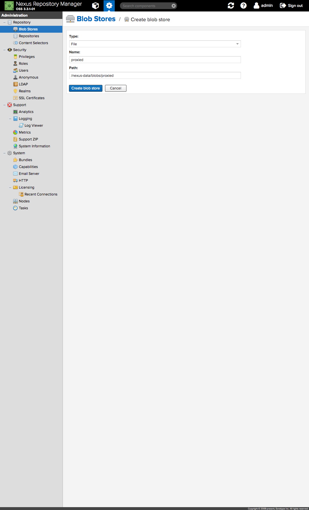
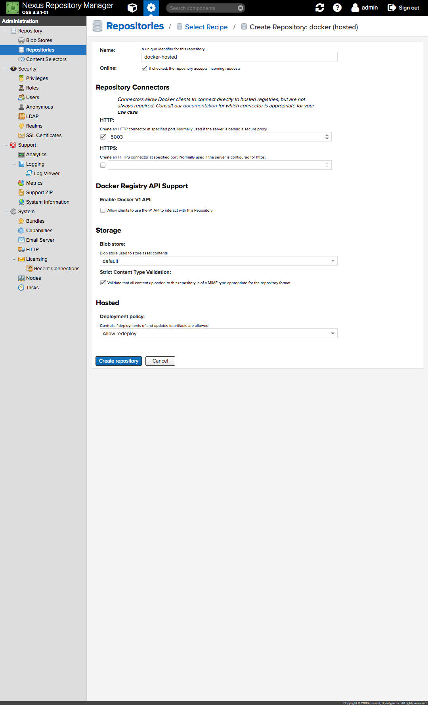
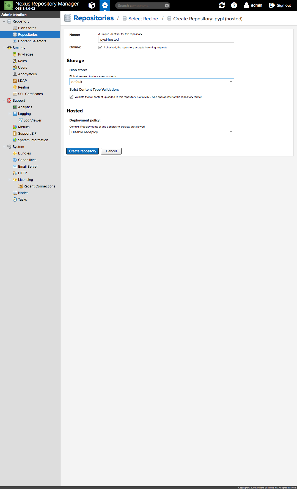
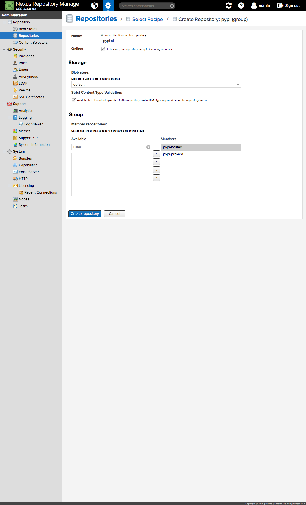
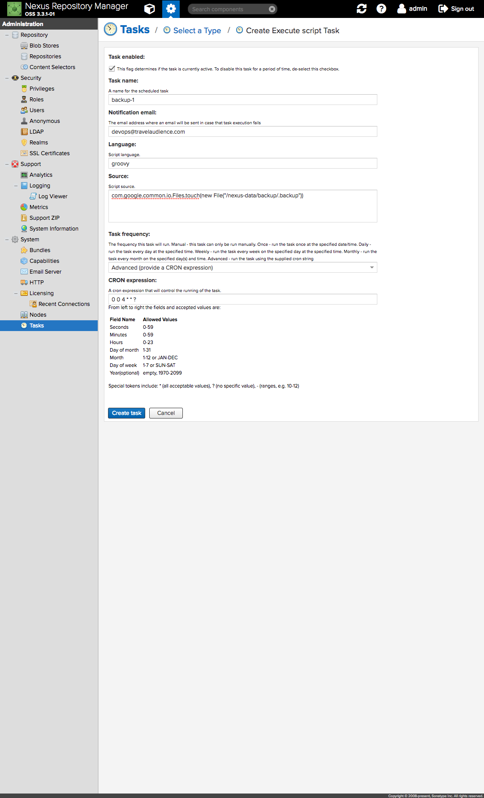

# Configuring Nexus

## Change the default credentials and email address

Login as `admin` (the default password is `admin123`) and head over to
_Administration/Security/Users_.
Click the `admin` user and change its password by pointing to
_More > Change password_. Make sure to change the email address as well.

## Create a blob store to host proxied artifacts

Nexus comes pre-configured with a `default` blob store which is used by all
repositories. Since this blob store is included in periodic backups it is
recommended to create a new blob store to host proxied/cached artifacts that do
not require backup (e.g., those coming from Maven Central).

Head over to _Administration/Blob Stores_ and click _Create blob store_.
Configure the new blob store according to the following settings:

Finally, click _Create blob store_ to finish the process.

## Configure the `maven-central` proxy to use the `proxied` blob store

Once you create the `proxied` blob store you must configure the `maven-central`
proxy to use the new blob store. Unfortunately it is not possible to change the
blob store associated with an already existing repository, so you must delete
the `maven-central` repository and re-create it.

Head-over to _Administration/Repositories_, click _Create repository_, choose
the `maven (proxied)` recipe and configure it according to the following settings:

Make sure you choose `proxied` as the underlying blob store.

After re-creating the `maven-central` repository it is necessary to edit the
`maven-public` group. Head over to `maven-public` and add `maven-central` to the
list of _Member repositories_ at the bottom of the page:

## Configure the `docker-hosted` repository

In order for Nexus to act as a Docker registry for internal images, an hosted
repository must be created. Head over to _Administration/Repositories_, click
_Create repository_, choose the `docker (hosted)` recipe and configure it
according to the following settings:

Make sure your choose `5003` as the port for the HTTP connector and `default` as
the underlying blob store. Finally, click _Create repository_ to finish the
process.

## Configure the `pypi-all` repository group

In order for Nexus to act as a repository for Python software it is necessary to
create a `pypi-all` repository that will group together two other repositories —
a `pypi-proxied` repository, which will proxy packages from
[PyPI](https://pypi.python.org/pypi), and a `pypi-hosted` repository, which will
host packages developed internally.

### Configuring `pypi-proxied`

Head over to _Administration/Repositories_, click _Create repository_, choose
the `pypi (proxy)` recipe and configure it according to the following settings:

Please make sure you choose `proxied` as the underlying blob store. Finally,
click _Create repository_ to finish the process.

### Configuring `pypi-hosted`

Head over to _Administration/Repositories_, click _Create repository_, choose
the `pypi (hosted)` recipe and configure it according to the following settings:

Please make sure you choose `default` as the underlying blob store. Finally,
click _Create repository_ to finish the process.

### Configuring `pypi-all`

Head over to _Administration/Repositories_, click _Create repository_, choose
the `pypi (group)` recipe and configure it according to the following settings:

Please make sure you choose `default` as the underlying blob store. Finally,
click _Create repository_ to finish the process.

## Configure backup tasks and create backup scripts

For the implemented backup process to work as expected you must create a couple
of periodic tasks.

The first task, called `backup-1`, will be responsible for triggering the backup
procedure itself. Head over to _Administration/Tasks_, click _Create task_,
choose _Execute script_ and create the new task according to the following
settings:

This will cause Nexus to `touch` the `/nexus-data/backup/.backup` file everyday
at 4am UTC, triggering the backup process (as there's a process monitoring this
file that reacts to changes and starts the process).

The second task, called `backup-2`, will be responsible for backing-up the Nexus
databases, configurations and metadata. Head over to
_Administration/Tasks_, click _Create task_, choose
_Export configuration & metadata for backup_ and create the new task according
to the following settings:

This will cause Nexus to backup its internal databases everyday at 4am UTC.
The abovementioned process waits for this task to complete and includes the
resulting file in the backup bundle.
